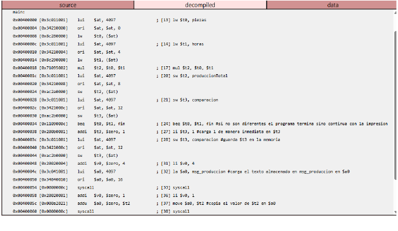
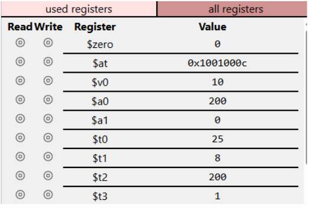
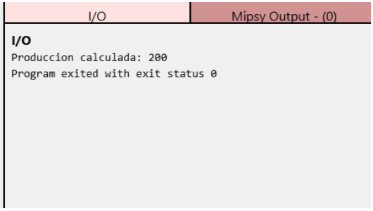

# Producción de una fábrica en MIPS

**Asignatura:** UCOM250 Organización y Arquitectura de Computadores  
**Integrantes:** Briana Chang y Jose Gabela  
**Año:** 2026  
**Fecha:** 8 de Octubre del 2026

---

## Descripción

### Escenario

Una máquina produce 25 piezas por hora y trabaja durante 8 horas.

### Resultado esperado

El programa calcula la producción total: 25 × 8 = 200 piezas. También compara las piezas por hora con las horas trabajadas. Si son diferentes, muestra `Produccion calculada: 200`.

## Análisis

| Dato o resultado | Valor | Propósito | Operación e instrucción MIPS |
|---|---:|---|---|
| `piezas` | 25 | Piezas producidas por hora | Cargar con `lw` |
| `horas` | 8 | Horas trabajadas | Cargar con `lw` |
| `produccionTotal` | 200 | Producción total | Multiplicar con `mul` y almacenar con `sw` |
| `comparacion` | 1 | Indica que piezas y horas son diferentes | Comparar con `sne` y almacenar con `sw` |
| Diferencia | 17 y -17 | Restar los operandos en ambos órdenes | `sub` |
| Cociente y residuo | 3 y 1 | Dividir piezas entre horas | `div`, `mflo` y `mfhi` |
| Igualdad | 0 | Indica que los valores no son iguales | `seq` |
| Salida | `Produccion calculada: 200` | Mostrar el resultado si las cantidades son diferentes | `beq` y `syscall` |

## Implementación

La solución carga los datos desde memoria a registros, realiza las operaciones y almacena los resultados. La versión final usa `beq` para terminar sin imprimir si piezas y horas son iguales; si son diferentes, muestra la producción total.

- [Versión base](version_base/programa_base.s)
- [Versión final](version_final/programa_final.s)

Para ejecutar el programa, abre `version_final/programa_final.s` en MARS o QtSPIM y ensámblalo y ejecútalo. Con los datos actuales, la salida esperada es `Produccion calculada: 200`.

## Evidencias de ejecución

### Código

### Registros

### Resultado

## Conclusiones

La actividad permitió observar cómo los datos pasan de memoria a registros, se procesan y se almacenan nuevamente. También ayudó a comprender cómo una comparación y un salto condicional controlan el flujo del programa. La ejecución en el simulador permitió relacionar las instrucciones con los resultados obtenidos.

## Documentación

El [reporte final del proyecto](documentacion/reporte_proyecto.pdf) contiene el desarrollo completo.

## Bibliografía

MIPS Assembler and Runtime Simulator (n.d.). MARS.
http://courses.missouristate.edu/kenvollmar/mars/

MIPS Instruction Set (n.d.). University of New South Wales. Recuperado el 08 de octubre de 2026 de
https://cgi.cse.unsw.edu.au/~cs1521/current/resources/mips-guide.html

Patterson, D. A., & Hennessy, J. L. (2021). Computer organization and design: The hardware/software interface (6th ed.). Morgan Kaufmann.
